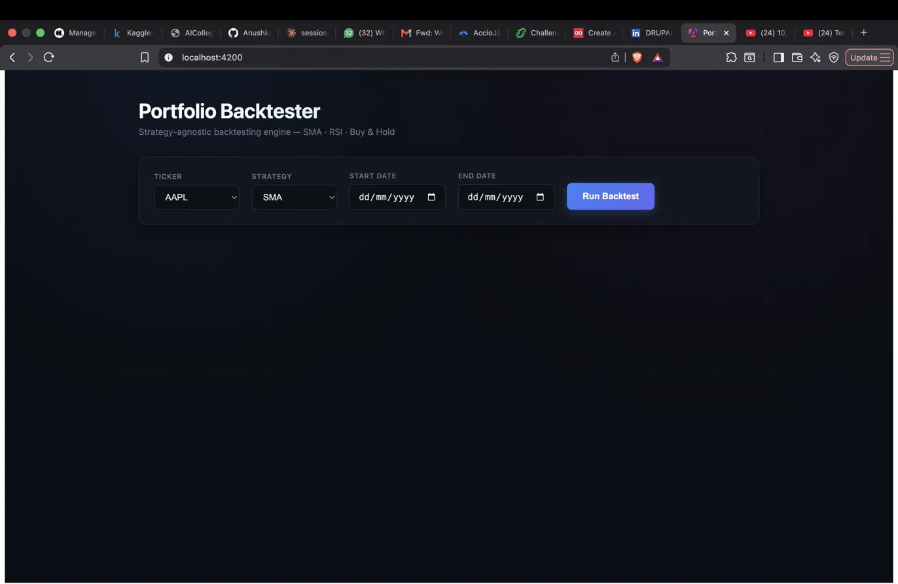
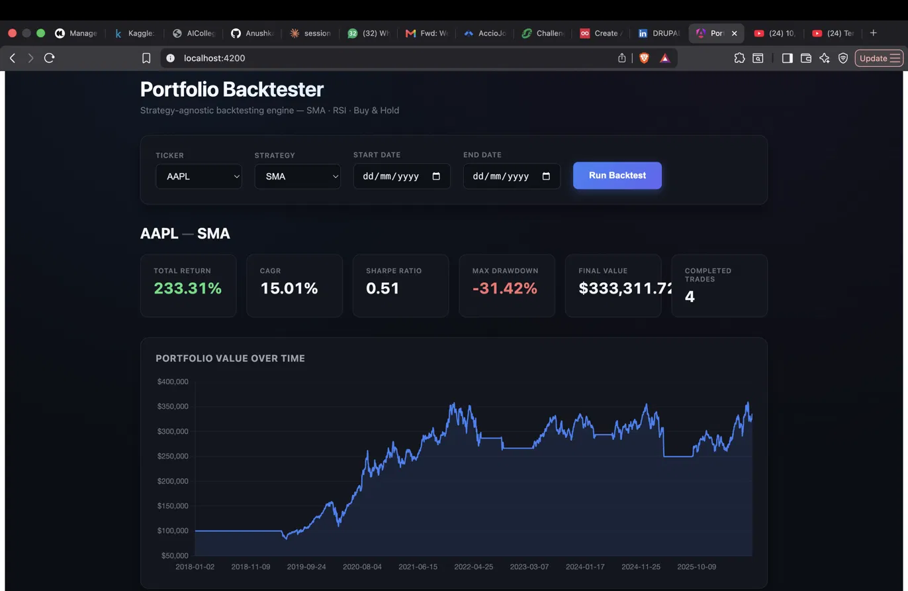
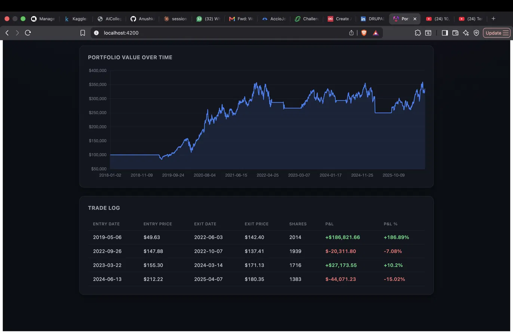

# Portfolio Backtester

A full-stack, strategy-agnostic backtesting engine for evaluating trading strategies against historical price data — with risk-adjusted metrics (Sharpe ratio, max drawdown, CAGR), multi-ticker validation, and an interactive web dashboard.

Built to answer a simple question honestly: **does a given trading strategy actually add value, or does it just look good on one lucky stock?**

---

## Screenshots

**Interactive dashboard — pick a ticker, strategy, and date range:**



**Results — risk-adjusted metrics and portfolio value over time:**



**Trade log — every completed trade with win/loss coloring:**



---

## What it does

The engine simulates trading a strategy over historical price data with a fixed starting capital, tracks every trade, and computes both raw returns and risk-adjusted performance metrics. Three strategies are implemented and run through the exact same backtesting engine:

- **SMA Crossover** — trend-following. Buys on a Golden Cross (50-day SMA crosses above 200-day), sells on a Death Cross.
- **RSI (14-day)** — mean-reversion. Buys when RSI drops below 30 (oversold), sells when it rises above 70 (overbought).
- **Buy & Hold** — the baseline. Buys once on day one, never sells.

Every strategy outputs the same shape of data (a `date` / `close` / `signal` table), so the backtesting engine itself never needs to know which strategy produced the signals — new strategies plug in without touching the engine.

---

## Architecture

```
Yahoo Finance (yfinance)
        │
        ▼
   MySQL (price_history)
        │
        ▼
 ┌──────────────────────────────┐
 │   Strategy Signal Generators  │   SMA · RSI · Buy & Hold
 │  (each outputs date/close/    │   — interchangeable, engine
 │   signal, independently)      │     doesn't know which ran
 └──────────────┬────────────────┘
                ▼
     BacktestEngine (strategy-agnostic)
     simulates trades, tracks P&L,
     produces a daily portfolio value series
                │
                ▼
        Metrics Layer
   Sharpe ratio · CAGR · Max Drawdown
                │
                ▼
        Flask REST API
   /api/tickers · /api/strategies · /api/backtest
                │
                ▼
       Angular Dashboard
   ticker/strategy picker, live chart, trade log
```

---

## Key findings

This project isn't just "build a backtester" — the more interesting part was stress-testing whether the results held up.

**On AAPL alone, RSI looked incredible: a 100% win rate over 10 trades.** That's a red flag, not a good sign — on a stock that trended up 683% over the test period, almost any "buy dip, sell later" strategy looks great, because the market did the work, not the strategy.

**Testing across 9 tickers spanning different sectors (tech, banking, energy, consumer staples, healthcare, industrials, media) told the real story:**

| Strategy | Avg. Sharpe (9 tickers) | Won on returns |
|---|---|---|
| Buy & Hold | 0.52 | 7 / 9 tickers |
| SMA Crossover | 0.31 | 1 / 9 tickers |
| RSI | **0.12** | 1 / 9 tickers |

RSI's average Sharpe ratio across the full ticker set collapsed to 0.12 — barely above zero — and it lost money outright on two tickers (DIS, NVDA). The "perfect" AAPL result was an artifact of AAPL's uptrend, not genuine strategy skill.

The two cases where an active strategy *did* beat Buy & Hold both make intuitive sense: **SMA won on XOM** (energy, more cyclical) and **RSI won on PFE** (the flattest, most range-bound stock in the set, where Buy & Hold itself only returned 20.6%). Trend-following and mean-reversion strategies work best in the market regimes they're built for — and fail outside them.

---

## Tech stack

**Backend:** Python, Flask, pandas, mysql-connector-python, yfinance
**Database:** MySQL
**Frontend:** Angular 20, Chart.js
**Data source:** Yahoo Finance (via `yfinance`)

---

## Running it locally

**1. Database**

Create a MySQL database and table:
```sql
CREATE DATABASE backtester;
USE backtester;
CREATE TABLE price_history (
    ticker VARCHAR(10),
    date DATE,
    open DECIMAL(10,4),
    high DECIMAL(10,4),
    low DECIMAL(10,4),
    close DECIMAL(10,4),
    volume BIGINT,
    PRIMARY KEY (ticker, date)
);
```

**2. Backend**
```bash
cd backend
python -m venv venv
source venv/bin/activate
pip install -r requirements.txt   # flask, flask-cors, pandas, mysql-connector-python, yfinance, matplotlib

# create config.py with your MySQL credentials:
#   DB_CONFIG = {"host": "localhost", "user": "root", "password": "...", "database": "backtester"}

python -m data.ingest AAPL 2018-01-01 2026-08-21   # repeat per ticker
python app.py   # starts the API on http://localhost:5001
```

**3. Frontend**
```bash
cd portfolio-dashboard
npm install
ng serve   # starts the dashboard on http://localhost:4200
```

---

## Limitations

Stated honestly, not hidden:

- **No transaction costs or slippage modeled.** Every backtest assumes zero-cost, instant execution.
- **No fundamentals or macro data.** Strategies trade purely on price action.
- **Long-only, all-in position sizing.** No shorting, no partial position sizes, no risk management beyond entry/exit signals.
- **Survivorship bias risk.** All 9 tickers tested are large, currently-listed companies — none delisted or went to zero, which flatters every strategy tested.
- **Single-strategy-family scope.** Only trend-following (SMA) and mean-reversion (RSI) are covered; no ML-based or multi-factor strategies.

---

## Project structure

```
backend/
  data/
    ingest.py          # fetches price data from Yahoo Finance into MySQL
  strategy.py           # SMA crossover signal generator
  rsi_strategy.py        # RSI signal generator
  backtest.py            # BacktestEngine — strategy-agnostic trade simulator
  metrics.py              # Sharpe / CAGR / max drawdown, SMA vs Buy&Hold comparison
  metrics_three_way.py     # SMA vs RSI vs Buy&Hold comparison
  multi_ticker_test.py      # runs all strategies across 9 tickers, aggregates results
  app.py                     # Flask API
portfolio-dashboard/
  src/app/
    app.ts                   # dashboard component
    backtest.service.ts       # Angular service calling the Flask API
```
